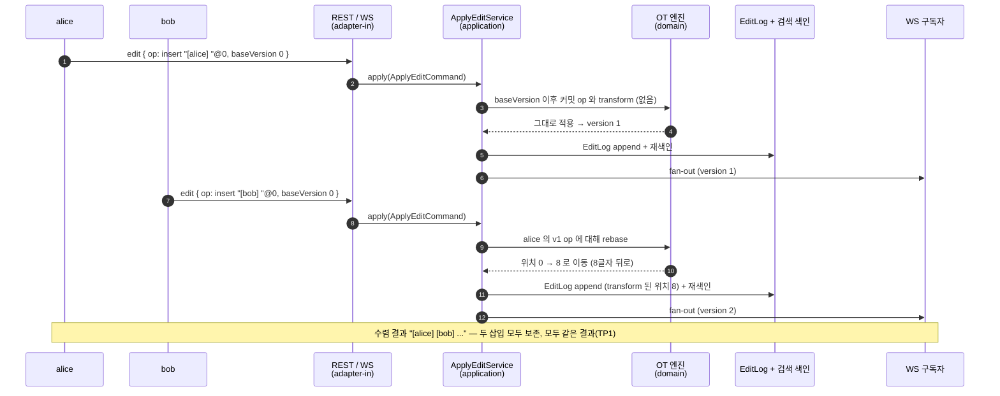
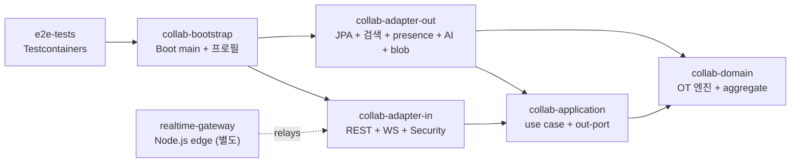

# collab-docs

[](https://github.com/ssa1004/collab-docs/actions/workflows/ci.yml)
[](#테스트-커버리지)
[](LICENSE)
[](https://kotlinlang.org/)
[](https://openjdk.org/projects/jdk/21/)
[](https://spring.io/projects/spring-boot)
[](https://nodejs.org/)

> **English summary** (한국어 본문은 아래에 이어집니다 / Korean documentation continues below.)
>
> A real-time collaborative document-editing backend with document AI. Multiple
> users edit the same plain-text document at once, and the server resolves
> concurrent edits with **server-authoritative Operational Transformation (OT)**
> so every client converges on the same text without losing edits. On top of that
> it serves full-text search and document AI (RAG-style ask + extractive summarize).
>
> It **boots with zero external infrastructure** — no Docker, no database, no API
> keys — and serves REST + WebSocket. The same code runs against real infra
> (PostgreSQL / OpenSearch / Redis / a real LLM) under the `prod` profile by
> swapping adapters behind ports. A thin Node.js edge gateway handles WS transport,
> auth and fan-out, but never runs OT — the Kotlin core stays authoritative.
>
> **Tech stack**: Kotlin 2.0 (JDK 21), Spring Boot 3.5.15 (Web · WebSocket ·
> Security · Data JPA), Gradle 8 multi-module, PostgreSQL + Flyway / H2, Redis /
> OpenSearch (both with in-memory fallbacks), springdoc OpenAPI, Node.js 20 +
> TypeScript (`ws`) gateway. Hexagonal across 5 Kotlin modules (`domain` →
> `application` → `adapter-in`/`adapter-out` → `bootstrap`), plus `e2e-tests` and a
> standalone `realtime-gateway`. 6 ADRs cover OT vs CRDT, the OT edge rule,
> zero-infra/offline-AI, presence/fan-out and the module boundaries — see
> [docs/adr/](docs/adr/).

---

실시간 협업 문서 편집 + 문서 AI 백엔드입니다. 여러 사용자가 같은 plain-text 문서를 동시에
편집하면, 서버가 **서버 권위 OT(Operational Transformation)**(= 동시 편집 시 서버가 심판이 되어 모든 편집을 한 줄로 줄 세워 충돌 없이 합쳐, 누가 먼저 들어오든 모두 같은 화면이 되게 하는 방식) 로 동시 편집 충돌을 해소해 편집
손실 없이 모두 같은 텍스트로 수렴시킵니다. 그 위에 전문 검색과 문서 AI(RAG 질의 + 추출 요약)
를 얹었습니다. **외부 인프라 0(Docker·DB·API 키 없음)**(= Docker·DB·API 키 같은 외부 준비물 하나 없이 명령 한 줄로 바로 켜지는 부팅) 으로 부팅해 REST + WebSocket 을
서빙하며, `prod` 프로필에서는 같은 코드가 어댑터만 바꿔 실 인프라(PostgreSQL / OpenSearch /
Redis / 실 LLM)로 동작합니다.

설계 의사결정의 상세 배경은 [docs/adr/](docs/adr/) 의 ADR 6건에 정리돼 있다 — OT vs CRDT,
OT 경계 규칙, zero-infra + offline AI, presence / fan-out, 헥사고날 모듈 경계(= 핵심 로직을 가운데 두고 DB·검색·웹은 콘센트와 플러그처럼 갈아끼우게 분리해, 바깥을 바꿔도 핵심 코드는 안 건드리는 모듈 구조).

## 기술 스택

- **Language**: 운영 코드 100% Kotlin 2.0.21 (JDK 21 toolchain — Gradle 이 Foojay 로 자동 조달).
- **Framework**: Spring Boot 3.5.15 (Web · WebSocket · Security · Data JPA)
- **Storage**: PostgreSQL 16 + Flyway (prod) / H2 in-memory (dev)
- **Search**: in-memory inverted index (dev) / OpenSearch (prod)
- **Presence / fan-out**: in-memory pub/sub (dev) / Redis Lettuce (prod)
- **Document AI**: offline 결정론 추출 (dev) / 실 LLM `HttpLlmAdapter` (prod)
- **Edge gateway**: Node.js 20 + TypeScript + `ws` (전송 / 인증 / fan-out — OT 미수행)
- **API doc**: springdoc-openapi (OpenAPI 3.1)
- **Build / CI**: Gradle 8 multi-module, GitHub Actions, Docker, Helm

## 핵심 설계 결정

### 1. 서버 권위 OT — 동시 편집을 결정론으로 수렴

같은 버전을 두 사용자가 동시에 편집하는 게 어려운 부분이다. 클라이언트는 `(op, baseVersion)`
을 보낸다. 서버(`ApplyEditService`)는 `baseVersion` 이후 커밋된 동시 op 들에 대해 들어온 op 를
`transform` 으로 rebase(동점은 항상 커밋된 쪽이 이김 — 결정론), 적용, 버전 증가, EditLog
append, 검색 재색인, 협업자에게 fan-out 한다. 두 삽입 모두 살아남고 모든 클라이언트가 같은
결과로 수렴한다(TP1). 가장 까다로운 경계 — 동시 delete 범위 내부로 들어오는 insert — 는
[ADR-0003](docs/adr/0003-ot-edge-rule.md) 에 규칙을 고정하고 속성 테스트로 증명한다.
모델 선택(OT vs CRDT)의 트레이드오프는 [ADR-0002](docs/adr/0002-ot-vs-crdt.md).

> plain-text `insert` / `delete`(+ `composite`) 한정이다. rich-text(서식·표)와 CRDT 는
> 범위 밖 — 재검토 트리거는 [ADR-0002](docs/adr/0002-ot-vs-crdt.md) 에 적었다.

### 2. 단일 진실 공급원 — REST·WS 어느 쪽으로 들어와도 같은 fan-out

권위 OT 가 `ApplyEditService` 한 곳에서만 일어나므로, REST 든 WS 든 어느 경로로 들어온 편집도
모든 WS 구독자에게 동일하게 fan-out 된다. presence(커서·선택·typing) 와 op 전파 설계는
[ADR-0005](docs/adr/0005-presence-and-fanout.md). Node.js edge 게이트웨이는 전송·인증·fan-out
만 담당하고 **op 를 transform 하지 않는다** — 권위는 Kotlin 코어.

### 3. Zero-infra 기본 부팅 — 어댑터 교체로 prod 전환

기본 프로필은 H2 + in-memory 검색 / presence + offline AI 로, Docker·DB·API 키 없이 부팅한다.
같은 port 인터페이스 뒤에서 `collab.*` 프로퍼티로 어댑터만 토글하면 PostgreSQL / OpenSearch /
Redis / 실 LLM 으로 교체된다([ADR-0004](docs/adr/0004-zero-infra-and-offline-ai.md),
[ADR-0005](docs/adr/0005-presence-and-fanout.md)).

> zero-infra 기본값은 단일 노드·비영속이다. 재시작 시 초기화, 수평 확장 불가. 영속·확장은
> `prod` 프로필로 Postgres / OpenSearch / Redis 를 붙여야 한다.

> dev 인증은 실 인증이 아니다. `Authorization: Bearer <이름>` 의 평문이 그대로 userId 가 된다
> (서명 검증 없음 — 데모용 사용자 흉내). 실 JWT 검증은 `prod` 전용이다.

### 4. Offline 결정론 AI(= 인터넷·API 키 없이 돌고, 같은 질문엔 늘 같은 답을 내는 데모용 AI — 진짜 LLM 아님) — LLM 아님

`ask` / `summarize` 의 기본값은 추출(extractive) 결정론 알고리즘(키워드 / embedding 검색 +
문장 추출)이다. 모든 답변에 `"[offline] 결정론 추출 모드(LLM 아님)."` prefix + `offline:true`
를 붙인다. 실 LLM 은 같은 `AiAssistPort` 뒤에 pluggable(`collab.ai=llm`, `prod`) —
[ADR-0004](docs/adr/0004-zero-infra-and-offline-ai.md).

> 기본 AI 는 외부 호출이 0 이라 결정론이고, 답변에 출처(문서 chunk)를 그대로 붙인다. 실
> LLM 연동은 prod 프로필의 `HttpLlmAdapter` 뒤로 빠져 있어 dev 데모를 흐리지 않는다.

전체 6건은 [docs/adr/](docs/adr/) — [0001 아키텍처](docs/adr/0001-architecture.md) ·
[0002 OT vs CRDT](docs/adr/0002-ot-vs-crdt.md) · [0003 OT 경계 규칙](docs/adr/0003-ot-edge-rule.md) ·
[0004 zero-infra & offline AI](docs/adr/0004-zero-infra-and-offline-ai.md) ·
[0005 presence & fan-out](docs/adr/0005-presence-and-fanout.md) ·
[0006 헥사고날 경계](docs/adr/0006-hexagonal-module-boundaries.md).

## 시스템 흐름

편집 1건이 들어와 OT rebase → 커밋 → fan-out 까지 가는 happy path.



## 모듈 구조

헥사고날(ports & adapters). Kotlin 코어 5개 모듈은 의존성이 항상 안쪽(도메인)을 향하고,
Node.js edge 게이트웨이는 별도 프로세스다([ADR-0006](docs/adr/0006-hexagonal-module-boundaries.md)).



| 모듈 | 책임 |
|---|---|
| `collab-domain` | 순수 Kotlin, 프레임워크 의존성 0. **OT 엔진**(`TextOperation` · transform · apply · `Composite`) + aggregate(Document, ShareAcl, Comment, Folder, DocumentChunk). 동시성 핵심을 단위 테스트로 고정 |
| `collab-application` | use case(`@Service`) + 권한 + RAG 파이프라인 + **out-port 인터페이스 소유**(DIP — 어댑터가 구현) |
| `collab-adapter-in` | driving 어댑터 — REST 컨트롤러 · WebSocket 핸들러 · Spring Security |
| `collab-adapter-out` | driven 어댑터 — JPA · 검색 · presence · AI · blob. 관심사마다 dev(in-memory/offline) / prod(실 인프라) 어댑터를 `collab.*` 프로퍼티로 토글 |
| `collab-bootstrap` | Spring Boot `main` + `application.yml` 프로필. 모든 모듈이 만나는 유일한 지점 |
| `e2e-tests` | prod 어댑터 대상 Testcontainers 통합 시나리오 |
| `realtime-gateway` *(Node.js)* | edge WS 게이트웨이 — JWT 인증 + 연결 mux + op relay + fan-out. **OT 는 하지 않는다** — 백엔드가 권위 |

## Capabilities

| 기능 | 진입점 | 기본 (zero-infra) | `prod` 프로필 |
|---|---|---|---|
| 문서 생성 / 조회 / 목록 | `POST·GET /api/documents`, `GET /api/documents/{id}` | H2 in-memory | PostgreSQL + Flyway |
| 제목 변경 | `PUT /api/documents/{id}/title` | H2 | PostgreSQL |
| **동시 편집 (서버 권위 OT)** | `POST /api/documents/{id}/edit`, `WS /ws/documents/{id}` | in-process OT, H2 EditLog | same OT, PostgreSQL |
| 버전 이력 (EditLog) | `GET /api/documents/{id}/versions` | H2 | PostgreSQL |
| 공유 / ACL (OWNER / EDITOR / VIEWER) | `PUT·DELETE /api/documents/{id}/share` | H2 | PostgreSQL |
| 댓글 (point / range anchor) | `POST·GET /api/documents/{id}/comments` | H2 | PostgreSQL |
| 전문 검색 | `GET /api/search?q=` | in-memory inverted index | OpenSearch |
| **문서 AI — ask (RAG)** | `POST /api/documents/{id}/ask` | **offline 결정론 추출** (`offline:true`) | 실 LLM `HttpLlmAdapter` |
| **문서 AI — summarize** | `POST /api/documents/{id}/summarize` | **offline 결정론 추출** (`offline:true`) | 실 LLM |
| 실시간 presence / fan-out | `WS /ws/documents/{id}` | in-memory pub/sub | Redis pub/sub |
| OpenAPI | `GET /v3/api-docs(.yaml)`, `GET /swagger-ui.html` | springdoc | same |

## 실행 방법

JDK 만 있으면 된다(17+ 호스트 OK — Gradle 이 Foojay 로 JDK 21 toolchain 을 자동 조달). Docker·DB·API 키 불필요.

```bash
# 기본 프로필 부팅 (H2 + in-memory 검색/presence + offline AI)
./gradlew :collab-bootstrap:bootRun --args='--server.port=8080'

# 또는 전체 happy path 를 부팅 → 실행 → 종료까지 한 번에
./scripts/demo.sh
```

dev 인증은 permissive: `Authorization: Bearer <이름>` 의 평문이 그대로 userId 가 된다(서명 검증
없음 — dev 전용). 생략하면 `demo-user`.

### curl

```bash
BASE=http://localhost:8080

# 1) 문서 생성 (owner = alice)
ID=$(curl -s -X POST $BASE/api/documents \
  -H 'Content-Type: application/json' -H 'Authorization: Bearer alice' \
  -d '{"title":"Q3 Launch Plan","content":"The collab-docs project supports realtime editing. Operational transform keeps concurrent edits convergent. Search and document AI assist are built in."}' \
  | yq -p=json '.id')

# 2) bob 에게 EDITOR 로 공유 (두 협업자가 같이 편집)
curl -s -X PUT $BASE/api/documents/$ID/share \
  -H 'Content-Type: application/json' -H 'Authorization: Bearer alice' \
  -d '{"targetUserId":"bob","role":"EDITOR"}'

# 3) 같은 baseVersion 0 에서 동시 편집 2건 → 서버가 두 번째를 rebase
curl -s -X POST $BASE/api/documents/$ID/edit \
  -H 'Content-Type: application/json' -H 'Authorization: Bearer alice' \
  -d '{"op":{"type":"insert","position":0,"text":"[alice] "},"baseVersion":0}'
curl -s -X POST $BASE/api/documents/$ID/edit \
  -H 'Content-Type: application/json' -H 'Authorization: Bearer bob' \
  -d '{"op":{"type":"insert","position":0,"text":"[bob] "},"baseVersion":0}'
#  -> bob 의 op 가 위치 8 로 transform 되어 돌아오고, 문서는 "[alice] [bob] The collab-docs ..." 로 수렴

# 4) 전문 검색
curl -s "$BASE/api/search?q=transform&limit=5" -H 'Authorization: Bearer alice'

# 5) 문서 질의 (RAG — 기본 offline 결정론)
curl -s -X POST $BASE/api/documents/$ID/ask \
  -H 'Content-Type: application/json' -H 'Authorization: Bearer alice' \
  -d '{"question":"What keeps concurrent edits convergent?","topK":3}'

# 6) 요약 (extractive — offline:true)
curl -s -X POST $BASE/api/documents/$ID/summarize -H 'Authorization: Bearer alice'

# 7) 텍스트 range 에 댓글
curl -s -X POST $BASE/api/documents/$ID/comments \
  -H 'Content-Type: application/json' -H 'Authorization: Bearer alice' \
  -d '{"anchor":{"kind":"range","start":0,"endExclusive":7},"body":"Who is editing here?"}'

# 8) 버전 이력 (OT EditLog)
curl -s $BASE/api/documents/$ID/versions -H 'Authorization: Bearer alice'
```

### WebSocket (라이브 협업)

`ws://localhost:8080/ws/documents/{id}` 로 연결한다. userId 는 `Authorization: Bearer <id>`,
`?userId=<id>`, 또는 fallback `demo-user`. 모든 프레임은 JSON text 이고 `op` 형태는 REST 와 동일하다.

```jsonc
// server -> you, on connect
{"type":"welcome","documentId":"<id>","userId":"alice"}

// you -> server: 편집
{"type":"edit","op":{"type":"insert","position":0,"text":"hi "},"baseVersion":2}

// server -> you (sender): rebase 된 op + 새 버전
{"type":"ack","op":{"type":"insert","position":0,"text":"hi "},"version":3}

// server -> 방 전체 (you 포함): 커밋된 transform 결과
{"type":"edit","documentId":"<id>","op":{...},"version":3}

// you -> server: presence (커서 / 선택 / typing)
{"type":"presence","cursor":12,"selectionStart":12,"selectionEnd":18,"typing":true}
// server -> 방
{"type":"presence","documentId":"<id>","userId":"alice","cursor":12,"selectionStart":12,"selectionEnd":18,"typing":true}
```

권위 OT 가 `ApplyEditService` 에서 일어나므로 **REST·WS 어느 쪽**으로 들어온 편집도 모든 WS
구독자에게 동일하게 fan-out 된다 — 단일 진실 공급원. [`websocat`](https://github.com/vi/websocat) 으로 빠른 확인:

```bash
websocat "ws://localhost:8080/ws/documents/$ID?userId=carol"
# 붙여넣기: {"type":"edit","op":{"type":"insert","position":0,"text":"hi "},"baseVersion":2}
```

## 테스트·커버리지

```bash
./gradlew check                       # 단위 테스트
./gradlew :collab-domain:test         # OT 엔진 단위 (동시성 핵심)
./gradlew :collab-bootstrap:bootJar   # 배포용 jar
```

운영 소스가 100% Kotlin 이라 JaCoCo 대신 Kotlin-native 인
[Kover](https://github.com/Kotlin/kotlinx-kover) 로 커버리지를 집계한다. 루트가 5개 운영
모듈(domain / application / adapter-in / adapter-out / bootstrap)의 단위 테스트를 단일
리포트로 모은다(`e2e-tests` 는 Docker 필요한 통합이라 제외).

```bash
./gradlew koverHtmlReport   # build/reports/kover/html/index.html
./gradlew koverXmlReport    # build/reports/kover/report.xml (CI 파싱용)
./gradlew koverLog          # 콘솔에 커버리지 % 출력
```

| 모듈 | 단위 테스트 | 검증 |
|---|---|---|
| `collab-domain` | 36 | OT transform / apply / Composite, TP1 수렴, delete 경계 규칙(ADR-0003), ShareAcl, Comment anchor, 버전 invariant |
| `collab-application` | 15 | use case — 동시 편집 rebase, 권한(ACL), RAG 파이프라인 |
| `collab-bootstrap` | 1 | Spring 컨텍스트 부팅 (zero-infra 프로필 wiring) |

> 합계 52건. `collab-adapter-in` / `collab-adapter-out` 단위 테스트와 `e2e-tests` 의
> Testcontainers 통합은 아직 스캐폴드 단계다(아래 [향후 개선 사항](#향후-개선-사항)).

## API

REST 표면은 **10 paths / 13 operations**. 정규화·커밋된 OpenAPI 3.1 스펙은
[`docs/openapi/collab-docs.yaml`](docs/openapi/collab-docs.yaml) — 러닝 앱에서 springdoc 으로
생성 후 결정론으로 정규화하며, 생성·drift 게이트 절차는
[`docs/openapi/README.md`](docs/openapi/README.md). 부팅 후 Swagger UI 는
`http://localhost:8080/swagger-ui.html`.

> WebSocket 프로토콜(`/ws/documents/{id}`)은 이 OpenAPI 문서에 포함되지 않는다 — OpenAPI 3.1
> 에 WS 모델이 없기 때문. WS wire 프로토콜은 위 [WebSocket](#websocket-라이브-협업) 절 참고.

## 인프라 / Helm

- `Dockerfile`: multi-stage 빌드(JDK 21 → JRE 21), non-root. `realtime-gateway/Dockerfile`
  은 Node 게이트웨이용.
- `helm/collab-docs/`: 같은 형상을 Helm chart 로 packaging. env 별 분기는 `values.yaml`(dev —
  replica 1, HPA / NetworkPolicy / ServiceMonitor off) / `values-prod.yaml`(prod — replica 3,
  HPA min3 max10, NetworkPolicy, ServiceMonitor on). secret 은 placeholder — 운영은 외부
  secret(ExternalSecrets / SealedSecret) 참조 가정.

```bash
helm lint helm/collab-docs
helm lint helm/collab-docs -f helm/collab-docs/values-prod.yaml

# 렌더링 미리보기 (dev / prod)
helm template collab-docs helm/collab-docs --namespace collab
helm template collab-docs helm/collab-docs --namespace collab -f helm/collab-docs/values-prod.yaml
```

CI(`.github/workflows/ci.yml`)는 매 push / PR 마다 Kotlin build + test, gateway lint /
typecheck / build / test, Helm lint·template·kubeconform·unittest, actionlint / hadolint 을 돌린다.

## Portfolio Set 통합

본 repo 는 단독으로도 동작하지만, 다음 repo 들이 한 시스템처럼 맞물리는 portfolio set 의 한
축입니다 — 프로필: <https://github.com/ssa1004/ssa1004>

| 레포 | 한 줄 소개 | 본 레포와의 관계 |
|---|---|---|
| [auth-service](https://github.com/ssa1004/auth-service) | OAuth2 / OIDC IdP — JWT 발행 + JWK Set 노출 | prod 에서 WS / REST 요청의 JWT 를 본 repo 가 검증 (issuer-uri / JWK Set) |
| [notification-hub](https://github.com/ssa1004/notification-hub) | 다채널 알림 (mail / push / Slack) | 댓글 / 공유 / mention 이벤트를 본 repo 가 발행 → hub 가 채널별 fan-out |
| [search-service](https://github.com/ssa1004/search-service) | commerce 상품 검색 백엔드 | 인접 검색 도메인 — 색인 / 검색 패턴(inverted index → 전용 엔진) 을 공유 |
| [security-log-search](https://github.com/ssa1004/security-log-search) | SIEM (보안 로그 정규화 + 검색 + 알람) | 본 repo 의 audit / access log 를 ingest 하는 sink |
| [graphql-gateway](https://github.com/ssa1004/graphql-gateway) | 백엔드 통합 GraphQL gateway (BFF) | 본 repo 의 문서 REST API 를 GraphQL 스키마로 stitching 해 통합 노출 |
| [realtime-feed-service](https://github.com/ssa1004/realtime-feed-service) | 실시간 호가 / 체결 feed 스트리밍 (WebFlux / SSE) | 실시간 / WebSocket fan-out 패턴 공유 — 인접 도메인 |
| [billing-platform](https://github.com/ssa1004/billing-platform) | B2B SaaS 결제 / 청구 / 정산 | 인접 도메인 — 같은 운영 환경 공유, 당장 직접 통합점은 없음 |
| [bid-ask-marketplace](https://github.com/ssa1004/bid-ask-marketplace) | 한정판 리셀 거래소 매칭 | 인접 도메인 — 같은 운영 환경 공유, 당장 직접 통합점은 없음 |
| [commerce-ops](https://github.com/ssa1004/commerce-ops) | 이커머스 + 관측성 플랫폼 | observability(metric / trace) 컨벤션 공유 |
| [gpu-job-orchestrator](https://github.com/ssa1004/gpu-job-orchestrator) | GPU job 오케스트레이터 | 인접 도메인 — 같은 운영 환경 공유, 당장 직접 통합점은 없음 |
| **collab-docs** | (본 저장소) 실시간 협업 문서 편집 + 문서 AI | 위 도메인과 맞물리는 협업 / 문서 축 |

본 repo 가 시연하는 패턴(서버 권위 OT / 헥사고날 / zero-infra ↔ prod 어댑터 토글 / RAG)은
"코드 → ADR(왜) → 이론" 으로 잇는다 — 왜(ADR) 는 [docs/adr/](docs/adr/), 이론은 짝 레포
[dev-lab](https://github.com/ssa1004/dev-lab).

## 향후 개선 사항

- rich-text / CRDT — 현재 plain-text OT 한정. 서식 · 표 지원 시 CRDT 재검토 트리거는 [ADR-0002](docs/adr/0002-ot-vs-crdt.md)
- 실 LLM 연동 정식화 — 현재 dev 는 offline 결정론 추출. prod `HttpLlmAdapter` 의 retry / timeout / 비용 가드 보강
- 수평 확장 — zero-infra 기본값은 단일 노드. Redis presence + OpenSearch 검색을 prod 에서 다중 인스턴스로 검증
- e2e Testcontainers — `e2e-tests` / `adapter-*` 단위 테스트 스캐폴드를 채워 prod 어댑터(PostgreSQL / OpenSearch / Redis) 통합 자동화
- prod JWT 검증 활성화 — 현재 dev `Bearer <id>` 는 서명 검증 없음. auth-service JWK Set 으로 WS / REST 진입점 강제

## 라이선스

[MIT](LICENSE).
