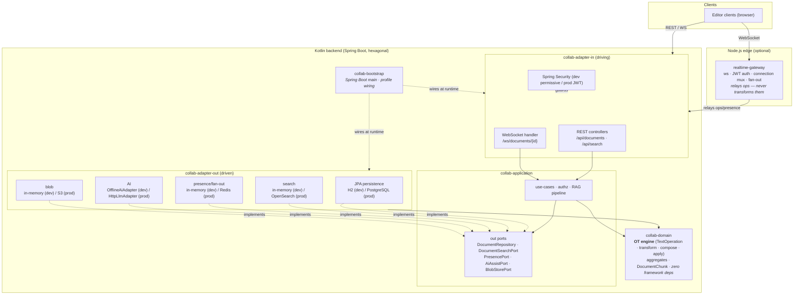

# collab-docs

**Real-time collaborative document editing + document AI** — a learning/portfolio backend.
Multiple people edit the same plain-text document at once; the server resolves concurrent edits with **server-authoritative Operational Transformation (OT)** so everyone converges on the same text without losing edits. On top of that it adds **full-text search** and **document AI** (RAG-style ask + extractive summarize).

It **boots with zero external infrastructure** — no Docker, no database, no API keys — and serves REST + WebSocket. The same code runs against real infrastructure (PostgreSQL / OpenSearch / Redis / a real LLM) under the `prod` profile, by swapping adapters behind ports.

> This is a personal project built to practice concurrency correctness, hexagonal architecture, and a polyglot edge/core split. It is intentionally honest about scope (see [Scope & honesty](#scope--honesty)).

---

## What makes it interesting: the OT concurrency story

Two users editing the *same* version of a document is the hard part. Here's the actual behavior, taken straight from `scripts/demo.sh`:

```
Document starts as:  "The collab-docs project supports realtime editing. ..."   (version 0)

alice: insert "[alice] " at position 0, baseVersion 0   -> committed as version 1
bob:   insert "[bob] "   at position 0, baseVersion 0   -> STALE (bob never saw v1)

The server REBASES bob's op against alice's already-committed op:
    bob's "[bob] " is transformed from position 0 -> position 8
    (shifted past the 8 characters alice just inserted)

Converged document:  "[alice] [bob] The collab-docs project supports realtime editing. ..."   (version 2)
```

Both inserts survive, in a deterministic order, on every client — that's [TP1 convergence](docs/adr/0002-ot-vs-crdt.md). The edit log (`GET /api/documents/{id}/versions`) shows bob's op stored at its transformed position 8, not the 0 he sent.

The client sends `(op, baseVersion)`. The server (`ApplyEditService`) takes every op committed after `baseVersion`, `transform`s the incoming op against each (the committed side always wins ties — deterministic), applies it, bumps the version, appends to the edit log, re-indexes for search, and fans the transformed op out to all collaborators. The trickiest boundary — an insert that lands *inside* a concurrent delete's range — has its own rule fixed in [ADR-0003](docs/adr/0003-ot-edge-rule.md) and pinned by property tests.

---

## Quickstart (zero-infra)

Requires a JDK (17+ host is fine — Gradle provisions the JDK 21 toolchain automatically via Foojay). Nothing else.

```bash
# boot it (default profile = H2 + in-memory search/presence + offline AI)
./gradlew :collab-bootstrap:bootRun --args='--server.port=8080'
```

Then drive the full happy path — or just run the script that does all of this and shuts down:

```bash
./scripts/demo.sh           # boots, runs the whole flow below, prints each response, shuts down
```

### curl by hand

Dev auth is permissive: `Authorization: Bearer <name>` is taken verbatim as the user id (no signature check — dev only). Omit it and you're `demo-user`.

```bash
BASE=http://localhost:8080

# 1) create a document (owner = alice)
ID=$(curl -s -X POST $BASE/api/documents \
  -H 'Content-Type: application/json' -H 'Authorization: Bearer alice' \
  -d '{"title":"Q3 Launch Plan","content":"The collab-docs project supports realtime editing. Operational transform keeps concurrent edits convergent. Search and document AI assist are built in."}' \
  | yq -p=json '.id')

# 2) share it with bob as EDITOR (so two real collaborators can edit)
curl -s -X PUT $BASE/api/documents/$ID/share \
  -H 'Content-Type: application/json' -H 'Authorization: Bearer alice' \
  -d '{"targetUserId":"bob","role":"EDITOR"}'

# 3) two CONCURRENT edits from the SAME baseVersion 0 -> the server rebases the second
curl -s -X POST $BASE/api/documents/$ID/edit \
  -H 'Content-Type: application/json' -H 'Authorization: Bearer alice' \
  -d '{"op":{"type":"insert","position":0,"text":"[alice] "},"baseVersion":0}'
curl -s -X POST $BASE/api/documents/$ID/edit \
  -H 'Content-Type: application/json' -H 'Authorization: Bearer bob' \
  -d '{"op":{"type":"insert","position":0,"text":"[bob] "},"baseVersion":0}'
#  -> bob's op comes back transformed to position 8; document converges to "[alice] [bob] The collab-docs ..."

# 4) full-text search
curl -s "$BASE/api/search?q=transform&limit=5" -H 'Authorization: Bearer alice'

# 5) ask the document (RAG; offline deterministic AI by default)
curl -s -X POST $BASE/api/documents/$ID/ask \
  -H 'Content-Type: application/json' -H 'Authorization: Bearer alice' \
  -d '{"question":"What keeps concurrent edits convergent?","topK":3}'

# 6) summarize (extractive; offline=true)
curl -s -X POST $BASE/api/documents/$ID/summarize -H 'Authorization: Bearer alice'

# 7) add a comment anchored to a text range
curl -s -X POST $BASE/api/documents/$ID/comments \
  -H 'Content-Type: application/json' -H 'Authorization: Bearer alice' \
  -d '{"anchor":{"kind":"range","start":0,"endExclusive":7},"body":"Who is editing here?"}'

# 8) list version history (the OT edit log)
curl -s $BASE/api/documents/$ID/versions -H 'Authorization: Bearer alice'
```

### WebSocket flow (live collaboration)

Connect to `ws://localhost:8080/ws/documents/{id}`. The user id comes from `Authorization: Bearer <id>`, `?userId=<id>`, or falls back to `demo-user`. All frames are JSON text. The `op` shape is identical to REST.

```jsonc
// server -> you, on connect
{"type":"welcome","documentId":"<id>","userId":"alice"}

// you -> server: an edit
{"type":"edit","op":{"type":"insert","position":0,"text":"hi "},"baseVersion":2}

// server -> you (the sender): your op rebased + the new version
{"type":"ack","op":{"type":"insert","position":0,"text":"hi "},"version":3}

// server -> everyone in the room (including you): the committed, transformed op
{"type":"edit","documentId":"<id>","op":{...},"version":3}

// you -> server: presence (cursor / selection / typing)
{"type":"presence","cursor":12,"selectionStart":12,"selectionEnd":18,"typing":true}
// server -> the room
{"type":"presence","documentId":"<id>","userId":"alice","cursor":12,"selectionStart":12,"selectionEnd":18,"typing":true}
```

Because authoritative OT happens in `ApplyEditService`, an edit entering over **REST or WS** fans out to **every** WS subscriber identically — there is one source of truth. Quick check with [`websocat`](https://github.com/vi/websocat):

```bash
websocat "ws://localhost:8080/ws/documents/$ID?userId=carol"
# paste: {"type":"edit","op":{"type":"insert","position":0,"text":"hi "},"baseVersion":2}
```

---

## Capabilities

| Capability | Endpoint(s) | Default (zero-infra) | `prod` profile |
|---|---|---|---|
| Create / get / list documents | `POST·GET /api/documents`, `GET /api/documents/{id}` | H2 in-memory | PostgreSQL + Flyway |
| Rename | `PUT /api/documents/{id}/title` | H2 | PostgreSQL |
| **Concurrent edit (server-authoritative OT)** | `POST /api/documents/{id}/edit`, `WS /ws/documents/{id}` | in-process OT, H2-backed edit log | same OT, PostgreSQL |
| Version history (edit log) | `GET /api/documents/{id}/versions` | H2 | PostgreSQL |
| Sharing / ACL (OWNER / EDITOR / VIEWER) | `PUT·DELETE /api/documents/{id}/share` | H2 | PostgreSQL |
| Comments (point / range anchors) | `POST·GET /api/documents/{id}/comments` | H2 | PostgreSQL |
| Full-text search | `GET /api/search?q=` | in-memory inverted index | OpenSearch |
| **Document AI — ask (RAG)** | `POST /api/documents/{id}/ask` | **offline, deterministic, extractive** (`offline:true`) | real LLM via `HttpLlmAdapter` |
| **Document AI — summarize** | `POST /api/documents/{id}/summarize` | **offline, deterministic, extractive** (`offline:true`) | real LLM |
| Real-time presence / fan-out | `WS /ws/documents/{id}` | in-memory pub/sub | Redis pub/sub |
| OpenAPI | `GET /v3/api-docs(.yaml)`, `GET /swagger-ui.html` | served by springdoc | same |
| Health | `GET /actuator/health` | `UP` (db: H2) | `UP` (db: PostgreSQL) |

API surface: **10 paths / 13 operations** — the committed, normalized spec lives at [`docs/openapi/collab-docs.yaml`](docs/openapi/collab-docs.yaml) (see [how it's generated](docs/openapi/README.md)).

---

## Architecture

Hexagonal (ports & adapters), 6 Gradle modules with dependencies pointing **inward** toward the domain, plus a separate Node.js edge gateway. Authoritative OT lives in the Kotlin core; the gateway is a thin transport/auth/fan-out edge ([ADR-0006](docs/adr/0006-hexagonal-module-boundaries.md), [ADR-0005](docs/adr/0005-presence-and-fanout.md)).



| Module | Role |
|---|---|
| `collab-domain` | Pure Kotlin, zero framework deps. **OT engine** + aggregates (Document, ShareAcl, Comment, Folder, DocumentChunk). The concurrency core, unit-tested in isolation. |
| `collab-application` | Use-cases (`@Service`), authorization, RAG pipeline, and **the out-port interfaces** (dependency inversion: adapters implement them). |
| `collab-adapter-in` | Driving adapters: REST controllers, WebSocket handler, Spring Security. |
| `collab-adapter-out` | Driven adapters: JPA, search, presence, AI, blob — each with a dev (in-memory/offline) and a prod (real infra) implementation toggled by `collab.*` properties. |
| `collab-bootstrap` | Spring Boot `main` + `application.yml` profiles. The only place all modules meet. |
| `e2e-tests` | Testcontainers integration scenarios against prod adapters. |
| `realtime-gateway` *(Node.js)* | Edge WebSocket gateway: JWT auth + connection multiplexing + op relay + fan-out. **Does not run OT** — the Kotlin backend is authoritative. |

### Tech stack

Kotlin 2.0.21 · JDK 21 (toolchain) · Spring Boot 3.5.15 (Web · WebSocket · Security · Data JPA) · Gradle 8.10.2 (multi-module) · PostgreSQL + Flyway / H2 · Redis (Lettuce) / OpenSearch — both with in-memory fallbacks · springdoc OpenAPI · Node.js 20 + TypeScript + `ws` (gateway).

---

## Scope & honesty

This is a learning project, so the boundaries are drawn on purpose and stated plainly:

- **Plain-text OT, not rich-text or CRDT.** Concurrency correctness is implemented for plain-text `insert`/`delete` (+ `composite`) and proven by property tests. Rich text (formatting, tables) and CRDTs are out of scope — see [ADR-0002 (OT vs CRDT)](docs/adr/0002-ot-vs-crdt.md) for the trade-offs and the explicit triggers to revisit.
- **Offline deterministic AI by default — it is not an LLM.** The default `ask`/`summarize` use an **extractive, deterministic** algorithm (keyword/embedding retrieval + sentence extraction). Every answer is prefixed `"[offline] 결정론 추출 모드(LLM 아님)."` and carries `offline: true`. A real LLM is pluggable behind the same `AiAssistPort` (`collab.ai=llm`, `prod`) — see [ADR-0004](docs/adr/0004-zero-infra-and-offline-ai.md).
- **Zero-infra defaults are single-node and non-persistent.** H2 in-memory, in-memory search, and in-memory presence reset on restart and don't scale horizontally. The `prod` profile swaps in PostgreSQL / OpenSearch / Redis behind the same ports — see [ADR-0005](docs/adr/0005-presence-and-fanout.md).
- **Dev auth is not real auth.** The dev `Bearer <id>` filter does no signature verification; it exists so you can impersonate users in a demo. Real JWT verification is the `prod` profile only.

## Documentation

- **ADRs** — [`docs/adr/`](docs/adr/): [0001 architecture](docs/adr/0001-architecture.md) · [0002 OT vs CRDT](docs/adr/0002-ot-vs-crdt.md) · [0003 OT edge rule](docs/adr/0003-ot-edge-rule.md) · [0004 zero-infra & offline AI](docs/adr/0004-zero-infra-and-offline-ai.md) · [0005 presence & fan-out](docs/adr/0005-presence-and-fanout.md) · [0006 hexagonal boundaries](docs/adr/0006-hexagonal-module-boundaries.md)
- **OpenAPI** — [`docs/openapi/collab-docs.yaml`](docs/openapi/collab-docs.yaml) + [generation/drift docs](docs/openapi/README.md)
- **Demo** — [`scripts/demo.sh`](scripts/demo.sh) (boots, runs the happy path, shuts down)

## License

[MIT](LICENSE).

---

<a name="korean"></a>

# collab-docs (한국어)

**실시간 협업 문서 편집 + 문서 AI** — 학습/포트폴리오 백엔드.
여러 사용자가 같은 plain-text 문서를 동시에 편집하면, 서버가 **서버 권위 OT(Operational Transformation)** 로 동시 편집 충돌을 해소해 **편집 손실 없이 모두 같은 텍스트로 수렴**시킨다. 그 위에 **전문 검색**과 **문서 AI**(RAG 질의 + 추출 요약)를 얹었다.

**외부 인프라 0(Docker·DB·API 키 없음)** 으로 부팅해 REST + WebSocket 을 서빙한다. `prod` 프로필에서는 같은 코드가 어댑터만 바꿔 실 인프라(PostgreSQL / OpenSearch / Redis / 실 LLM)로 동작한다.

> 동시성 정합성, 헥사고날 아키텍처, 폴리글랏 edge/core 분리를 연습하려고 만든 개인 프로젝트다. 범위는 [범위와 정직성](#범위와-정직성) 에 솔직히 적었다.

## 핵심: OT 동시성 이야기

같은 버전을 두 사용자가 동시에 편집하는 게 어려운 부분이다. `scripts/demo.sh` 의 실제 동작:

- `baseVersion 0` 에서 alice 가 `[alice] ` 를 위치 0 에 삽입 → version 1 커밋.
- bob 도 `baseVersion 0` 에서 `[bob] ` 를 위치 0 에 삽입 → bob 은 v1 을 못 봤으므로 **stale**.
- 서버가 bob 의 op 를 alice 의 이미 커밋된 op 에 대해 **rebase** → 위치 0 → **8** 로 이동(alice 가 끼운 8글자 뒤로).
- 수렴 결과: `"[alice] [bob] The collab-docs ..."` (version 2). 두 삽입 모두 살아남고, 모든 클라이언트가 같은 결과로 수렴(TP1).

클라이언트는 `(op, baseVersion)` 을 보낸다. 서버(`ApplyEditService`)는 `baseVersion` 이후 커밋된 동시 op 들에 대해 들어온 op 를 `transform` 으로 rebase(동점은 항상 커밋된 쪽이 이김 — 결정론), 적용, 버전 증가, EditLog append, 검색 재색인, 협업자에게 fan-out 한다. 가장 까다로운 경계(동시 delete 범위 내부로 들어오는 insert)는 [ADR-0003](docs/adr/0003-ot-edge-rule.md) 에 규칙을 고정하고 속성 테스트로 증명한다.

## 빠른 시작 (zero-infra)

JDK 만 있으면 된다(17+ 호스트 OK — Gradle 이 Foojay 로 JDK 21 toolchain 을 자동 조달).

```bash
./gradlew :collab-bootstrap:bootRun --args='--server.port=8080'
# 또는 전체 happy path 를 부팅→실행→종료까지 한 번에:
./scripts/demo.sh
```

dev 인증은 permissive: `Authorization: Bearer <이름>` 의 평문이 그대로 userId 가 된다(서명 검증 없음 — dev 전용). 위 영문 quickstart 의 curl 예시가 create / share / **동시 편집 수렴** / search / ask / summarize / comment / versions 전 과정을 보여준다. WebSocket(`/ws/documents/{id}`) 프로토콜도 영문 절을 참고.

## 아키텍처

헥사고날(ports & adapters) 6개 모듈 + Node.js edge 게이트웨이. 의존성은 항상 안쪽(도메인)을 향한다. 권위 OT 는 Kotlin 코어, 게이트웨이는 얇은 전송/인증/팬아웃 edge([ADR-0006](docs/adr/0006-hexagonal-module-boundaries.md), [ADR-0005](docs/adr/0005-presence-and-fanout.md)). 위 Mermaid 다이어그램 + 모듈 표 참고.

- `collab-domain` — 순수 Kotlin, 프레임워크 의존성 0. **OT 엔진** + aggregate. 동시성 핵심을 단위 테스트로 고정.
- `collab-application` — use-case + 권한 + RAG + **out-port 인터페이스 소유**(DIP).
- `collab-adapter-in` — REST · WebSocket · Security.
- `collab-adapter-out` — JPA · 검색 · presence · AI · blob. 각 관심사가 dev(in-memory/offline) / prod(실 인프라) 어댑터를 `collab.*` 프로퍼티로 토글.
- `collab-bootstrap` — Spring Boot main + 프로필.
- `e2e-tests` — Testcontainers 통합.
- `realtime-gateway`(Node.js) — edge WS 게이트웨이. **OT 는 하지 않는다** — 백엔드가 권위.

## 범위와 정직성

- **plain-text OT 한정.** rich-text/CRDT 는 범위 밖. 트레이드오프와 재검토 트리거는 [ADR-0002](docs/adr/0002-ot-vs-crdt.md).
- **기본 AI 는 offline 결정론 — LLM 아님.** `ask`/`summarize` 기본값은 추출(extractive) 결정론 알고리즘. 모든 답변에 `"[offline] 결정론 추출 모드(LLM 아님)."` prefix + `offline:true`. 실 LLM 은 같은 `AiAssistPort` 뒤에 pluggable([ADR-0004](docs/adr/0004-zero-infra-and-offline-ai.md)).
- **zero-infra 기본값은 단일 노드·비영속.** 재시작 시 초기화, 수평 확장 불가. `prod` 가 같은 port 뒤에서 Postgres/OpenSearch/Redis 로 교체([ADR-0005](docs/adr/0005-presence-and-fanout.md)).
- **dev 인증은 실 인증이 아니다.** 서명 검증 없음(데모용 사용자 흉내). 실 JWT 는 `prod` 전용.

## 라이선스

[MIT](LICENSE).
